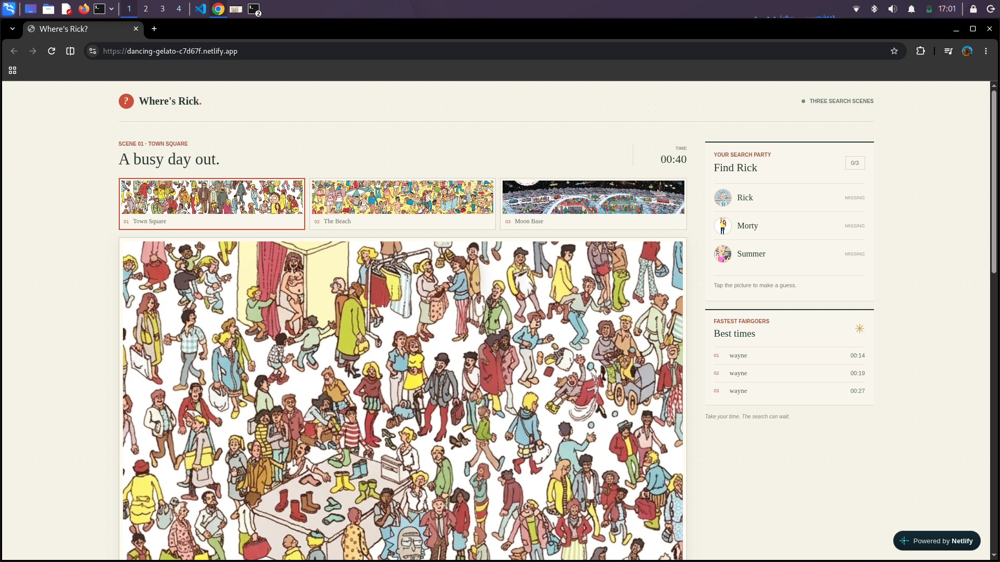

# Where's Rick?

A playable hidden-character game with a React/JSX client, an Express API, and PostgreSQL through Prisma ORM.

## How the App Works

Players choose one of three illustrated scenes and start a hunt without entering a name. Each scene has its own character roster: Scene 1 has Rick, Morty, and Summer; Scene 2 has Rick and Morty; Scene 3 has Rick, Morty, and Summer.

Clicking the board opens a picker for the characters not yet found. The browser sends the click as normalized image coordinates (`x` and `y` from `0` to `1`), so detection is relative to the displayed image size. The Express API checks the selected character against that scene's stored bounds or hit radius; it never trusts a client-side “found” result. Correct guesses are recorded in PostgreSQL, and the timer stops when all characters in the scene are found.

After completion, a modal asks for a name only if the player wants to save their time. The API verifies that the session is complete before creating a leaderboard entry. Players can abandon a round at any time by choosing another scene; the client clears the current progress and closes the old session.

### Runtime Layout

- **Netlify frontend:** serves the React/Vite app and the scene and portrait images from `client/public`.
- **Railway API:** runs Express routes for game sessions, guesses, quitting, scores, and leaderboard reads.
- **Railway PostgreSQL:** stores characters and their scene-relative hit regions, game sessions, discoveries, and leaderboard entries through Prisma.
- **Configuration:** the Netlify build uses `VITE_API_BASE_URL` to reach Railway. Railway limits browser requests with `CORS_ORIGINS`.

## Requirements

- Node.js 20.19 or newer
- PostgreSQL

## Setup

1. Create a PostgreSQL database named `where_is_rick`.
2. Copy `server/.env.example` to `server/.env` and update `DATABASE_URL` for your database.
3. Run `npm install` from the repository root.
4. Run `npm run db:generate` to generate the Prisma client.
5. Run `npm run db:migrate` to apply the database schema.
6. Run `npm run db:seed` to add the fairground characters.
7. Run `npm run dev` to start the client and API.

Run `npm test` for the coordinate validation tests and `npm run build` to build the React client.

The client is served at `http://localhost:5173`; the API listens on `http://localhost:3001`.

## Deploy with Railway and Netlify

The frontend is a Netlify static site and the Express API runs as a Railway service. The API and frontend use separate origins in production.

### Railway API

1. Create a Railway project from this repository and add a PostgreSQL service.
2. Create a Railway service from the repository. Keep its root directory at the repository root so npm workspaces are available.
3. Set the service build command to `npm run db:generate` and the start command to `npm start`. The root start script delegates to the Express server workspace, whose start script generates Prisma Client before launching Express.
4. Set the service pre-deploy command to `npm run db:deploy` so pending migrations are applied before each deploy.
5. Set these service variables:
   - `DATABASE_URL`: reference Railway PostgreSQL's `DATABASE_URL` variable.
   - `CORS_ORIGINS`: the exact Netlify site origin, for example `https://your-site.netlify.app` (no trailing slash). Add a custom domain as another comma-separated origin if needed.
   - `NPM_CONFIG_INCLUDE`: `dev`, because the current server start and Prisma commands use `tsx` and `prisma`, which are development dependencies.

Railway provides `PORT` automatically. After the first deploy, seed the character data once with `npm run db:seed` in the Railway service shell.

### Netlify frontend

1. Import the same repository into Netlify. The checked-in `netlify.toml` builds from the repository root and publishes `client/dist`.
2. Set the Netlify environment variable `VITE_API_BASE_URL` to the Railway service origin, for example `https://your-api.up.railway.app` (no trailing slash and no `/api` suffix).
3. Trigger a deploy. The frontend build embeds this public API URL; redeploy Netlify after changing it.

Check the Railway API at `/api/health` if the Netlify page loads but game requests fail. Make sure `CORS_ORIGINS` exactly matches the deployed Netlify origin.

Play the game at https://dancing-gelato-c7d67f.netlify.app/
